# GitOps CI/CD Pipeline using ArgoCD, Helm & Amazon EKS

<p align="center">
  
  
  
  
  
  
  
  
  
  
</p>

<p align="center">
  <b>Git is the Source of Truth &nbsp;•&nbsp; ArgoCD Pulls & Deploys &nbsp;•&nbsp; Jenkins does CI only (No direct access to Kubernetes)</b>
</p>

<p align="center">
  <code>① Code → ② Build → ③ Scan → ④ Build Image → ⑤ Scan Image → ⑥ Push Image → ⑦ ArgoCD Sync → ⑧ Deploy to EKS</code>
</p>

---

## Project Overview

This project implements a complete GitOps-based CI/CD pipeline on AWS, deploying the Spring PetClinic application into Amazon EKS using ArgoCD and Helm.

> ⭐ **Key differentiator:** Jenkins never deploys directly to Kubernetes. It only builds and updates the config repo. ArgoCD pulls the changes from Git and deploys automatically.

The project demonstrates:

- Modular infrastructure provisioning using Terraform (VPC, IAM, EKS modules)
- CI automation using Jenkins with static analysis and vulnerability scanning
- Pull-based GitOps deployment using ArgoCD with self-heal and drift detection
- Helm-based Kubernetes packaging with environment-specific value overrides
- Persistent monitoring using Prometheus and Grafana with EBS-backed storage

---

## Why GitOps?

Traditional push-based CD gives Jenkins direct cluster access:

```
Developer → Jenkins → kubectl apply → Kubernetes
```

This project uses pull-based GitOps:

```
Developer → Jenkins → Git Repo → ArgoCD → Kubernetes
```

| Benefit | How it's achieved |
|---|---|
| 🔒 Security | Jenkins never touches the cluster |
| 🔁 Self-healing | ArgoCD detects and reverts drift automatically |
| 📋 Auditability | Every deployment is a Git commit |
| ⏪ Rollback | `git revert` is all it takes |
| ✂️ Separation of concerns | CI and CD are fully decoupled |

---

## Architecture

<p align="center">
  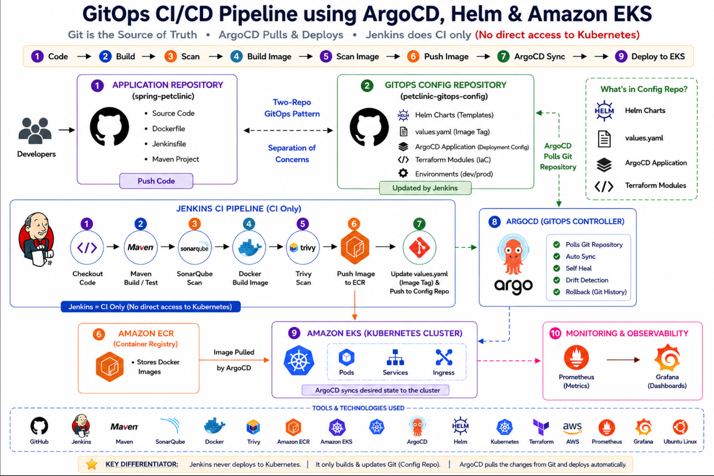
</p>

---

## Two-Repo GitOps Pattern

| Repository | Purpose |
|---|---|
| `petclinic-gitops-app` | Source code · Dockerfile · Jenkinsfile · CI scripts |
| `petclinic-gitops-config` | Helm charts · ArgoCD manifests · Terraform modules · Install scripts |

---

## Repository Structure

```
petclinic-gitops-config/
├── argocd/
│   └── application.yaml              ← ArgoCD application manifest
├── charts/petclinic/
│   ├── Chart.yaml
│   ├── values.yaml                   ← image tag updated automatically by Jenkins
│   └── templates/
│       ├── deployment.yaml
│       └── service.yaml
├── environments/
│   ├── dev/values-dev.yaml           ← dev overrides
│   └── prod/values-prod.yaml         ← prod overrides
├── terraform/
│   ├── main.tf
│   ├── variables.tf
│   ├── outputs.tf
│   └── modules/
│       ├── vpc/                      ← VPC, subnets, IGW, route tables, security groups
│       ├── iam/                      ← cluster role, node role, EBS CSI IRSA role
│       └── eks/                      ← EKS cluster, node group, OIDC provider, EBS CSI addon
├── cluster-tools-setup.sh            ← installs AWS CLI, kubectl, eksctl
├── jenkins-install.sh                ← installs Maven, Jenkins
├── argocd-install.sh                 ← installs ArgoCD into EKS
├── prometheus-grafana.sh             ← installs Helm, Prometheus and Grafana via Helm
├── trivy-install.sh                  ← installs Trivy on admin server
├── sonarqube-deployment.yaml         ← SonarQube Kubernetes manifest
└── README.md
```

---

## Infrastructure Setup

All infrastructure is provisioned using Terraform from an Ubuntu EC2 admin server. Tools are installed via the setup scripts included in this repo — no manual installation steps needed.

```bash
bash cluster-tools-setup.sh   # AWS CLI, kubectl, eksctl
bash trivy-install.sh         # Trivy image scanner
```

### Terraform Module Breakdown

| Module | Resources Created |
|---|---|
| `modules/vpc` | VPC, public subnets, internet gateway, route tables, security groups |
| `modules/iam` | EKS cluster role, node group role, EBS CSI IRSA role |
| `modules/eks` | EKS cluster, OIDC provider, managed node group, EBS CSI addon |

The EKS module includes the `aws-ebs-csi-driver` managed addon with IRSA authentication, enabling Prometheus, Grafana, and SonarQube to use EBS-backed PersistentVolumes so monitoring data survives pod restarts.

```bash
cd terraform/
terraform init
terraform plan
terraform apply

# configure kubectl after apply
aws eks update-kubeconfig --name <cluster-name> --region ap-south-1
kubectl get nodes -o wide
```

<details>
<summary><b>View terraform apply output</b></summary>
<br>
<p align="center">
  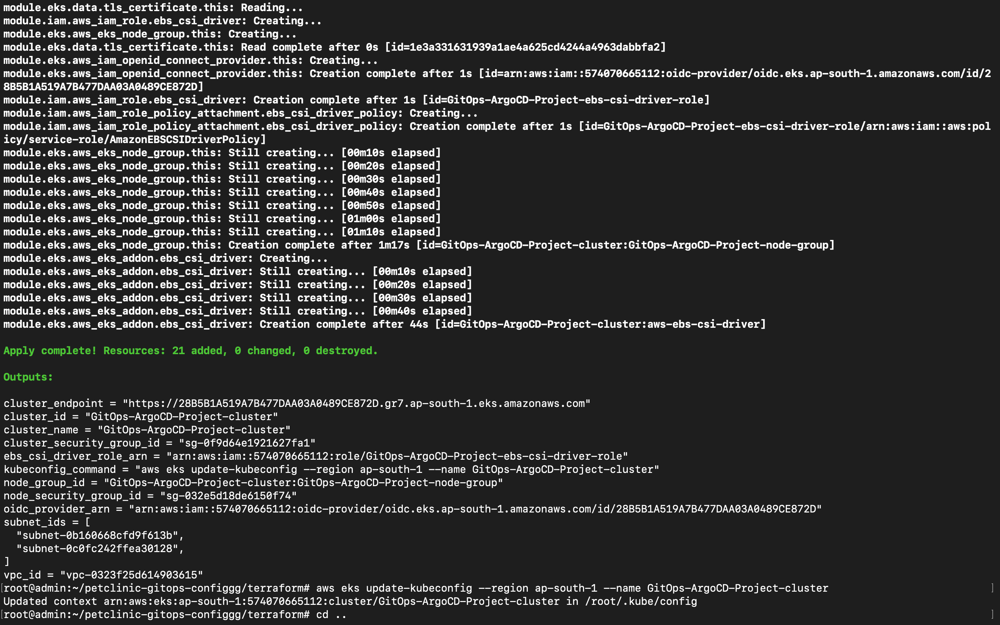
</p>
</details>

### Destroying Infrastructure

Kubernetes creates ELBs and EBS volumes outside Terraform's knowledge. Delete them first:

```bash
kubectl delete svc --all -A
kubectl delete pvc --all -A
sleep 60
terraform destroy
```

`main.tf` also includes `null_resource` cleanup blocks as a safety net that automatically removes remaining ELBs and EBS volumes during `terraform destroy`.

---

## SonarQube

SonarQube is deployed inside EKS with an EBS-backed PVC so analysis history persists across pod restarts.

```bash
kubectl apply -f sonarqube-deployment.yaml
kubectl get svc sonarqube-service
# access at http://<NODE-IP>:31000
```

After accessing the UI, generate a token and add it to Jenkins credentials as `Sonar_Token`.

<details>
<summary><b>View SonarQube dashboard</b></summary>
<br>
<p align="center">
  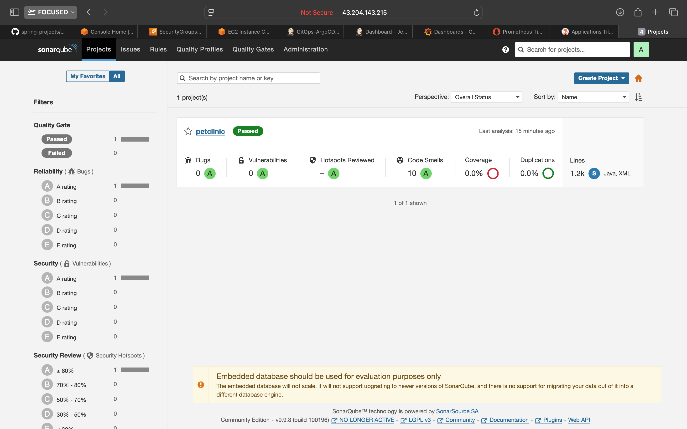
</p>
</details>

---

## Jenkins CI Pipeline

Jenkins handles CI only — it never deploys to Kubernetes directly.

### Pipeline Stages

| # | Stage | What it does |
|---|---|---|
| 1 | Checkout | Clones the app repo |
| 2 | Maven build | Compiles and packages the Spring Boot app |
| 3 | SonarQube scan | Static code analysis — fails pipeline on quality issues |
| 4 | Docker build | Builds the container image |
| 5 | Trivy scan | Blocks `CRITICAL` vulnerabilities before ECR push |
| 6 | Push to ECR | Tags image with Jenkins build number and pushes to ECR |
| 7 | Update config repo | Updates `values.yaml` image tag and pushes to config repo |

### Two Security Gates

```
┌─────────────────────────────────────────────────────────────┐
│  SonarQube — catches bad code before it becomes an image    │
│  Trivy     — catches vulnerable images before they ship     │
│                                                             │
│  If either gate fails → pipeline stops → nothing deploys   │
└─────────────────────────────────────────────────────────────┘
```

### Jenkins Credentials Required

| Credential ID | Purpose |
|---|---|
| `Git_Credentials` | Clone application repository |
| `Git_Token` | Push image tag updates to config repo |
| `Sonar_Token` | SonarQube authentication |

AWS credentials are configured under the Jenkins user via `aws configure`. Docker permissions are granted by adding Jenkins to the docker group:

```bash
sudo usermod -aG docker jenkins
sudo systemctl restart jenkins
```

<details>
<summary><b>View Jenkins pipeline execution</b></summary>
<br>
<p align="center">
  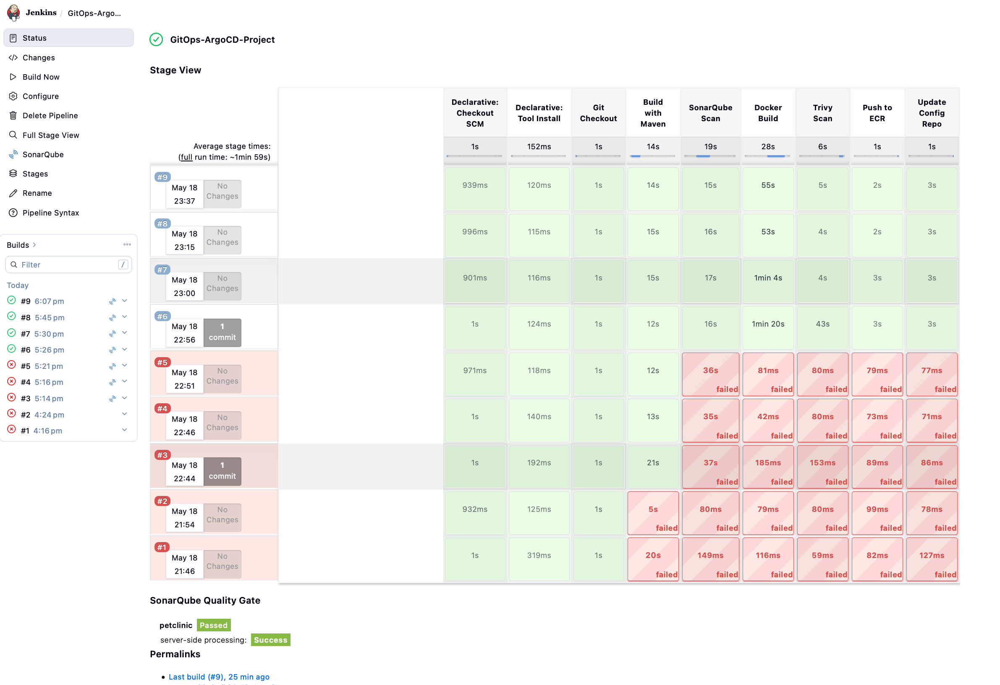
</p>
</details>

<details>
<summary><b>View ECR image push</b></summary>
<br>
<p align="center">
  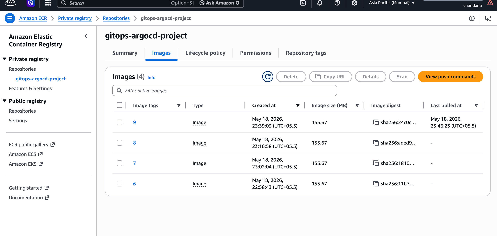
</p>
</details>

---

## ArgoCD — GitOps Deployment

ArgoCD runs inside the EKS cluster and polls the config repo every 3 minutes. When Jenkins pushes a new image tag to `values.yaml`, ArgoCD detects the change and automatically syncs the deployment — no manual intervention needed.

```bash
bash argocd-install.sh

# access the UI
kubectl get svc argocd-server -n argocd
# username: admin  |  password: printed by argocd-install.sh

# deploy the application
kubectl apply -f argocd/application.yaml
```

### ArgoCD Features Enabled

| Feature | Behaviour |
|---|---|
| ✅ Auto sync | Deploys automatically on any Git change |
| ✅ Self heal | Reverts manual `kubectl` changes back to Git state |
| ✅ Drift detection | Continuously compares live state vs Git |
| ✅ Rollback | Any previous Git commit can be restored |
| ✅ Prune | Removes Kubernetes resources deleted from Git |

<details>
<summary><b>View ArgoCD dashboards</b></summary>
<br>
<p align="center">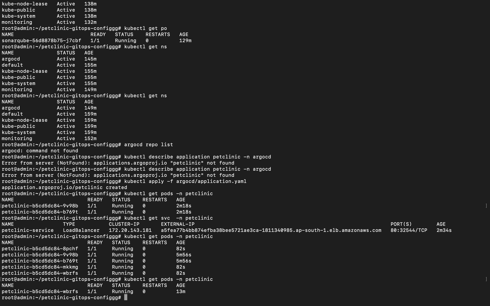</p>
<br>
<p align="center">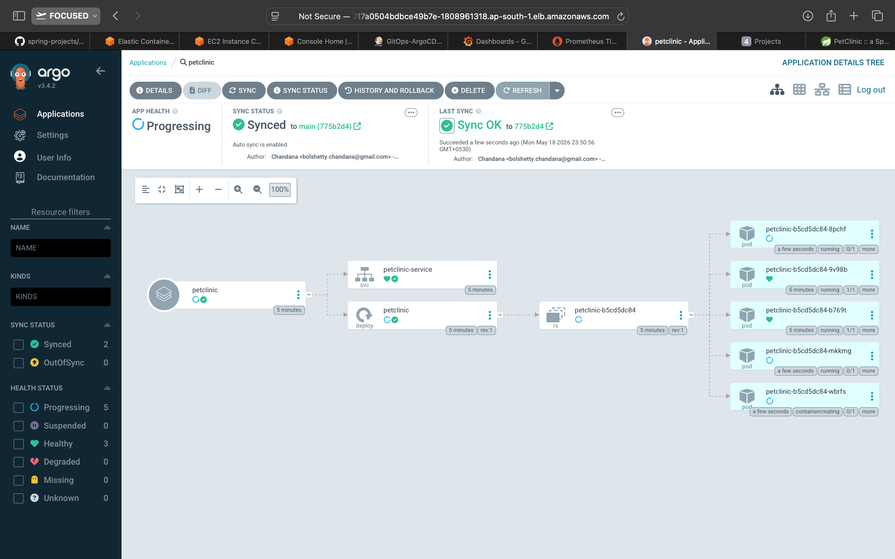</p>
<br>
<p align="center">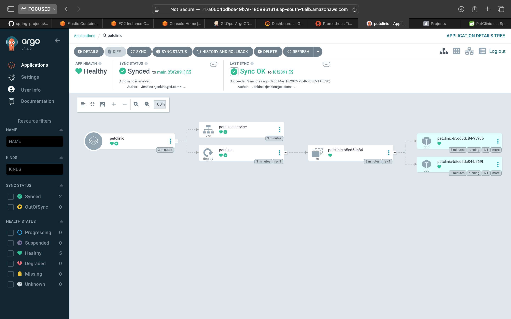</p>
<br>
<p align="center"></p>
<br>
<p align="center">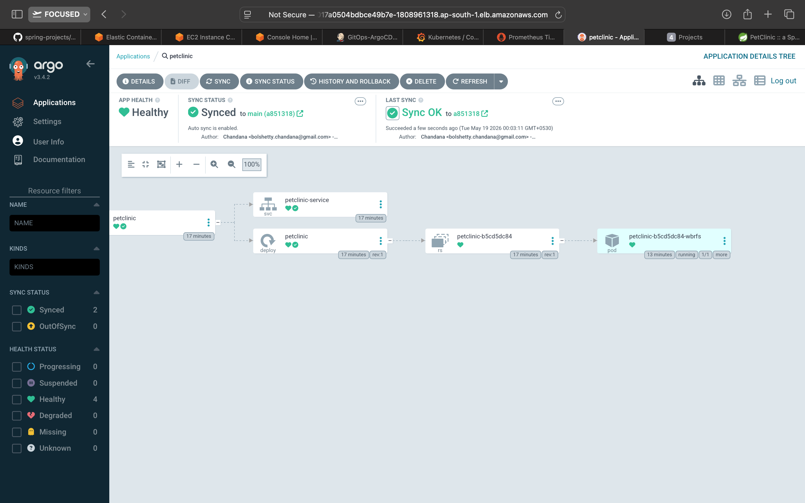</p>
</details>

---

## Monitoring & Observability

Prometheus and Grafana are installed using the `kube-prometheus-stack` Helm chart with EBS-backed persistent storage — monitoring data survives cluster restarts.

```bash
bash prometheus-grafana.sh

kubectl get pods -n monitoring    # all pods should reach Running
kubectl get pvc  -n monitoring    # all PVCs should show Bound
kubectl get svc  -n monitoring    # get external IPs for Prometheus and Grafana
```

Grafana default credentials: `admin / prom-operator`

<details>
<summary><b>View Prometheus dashboards</b></summary>
<br>
<p align="center">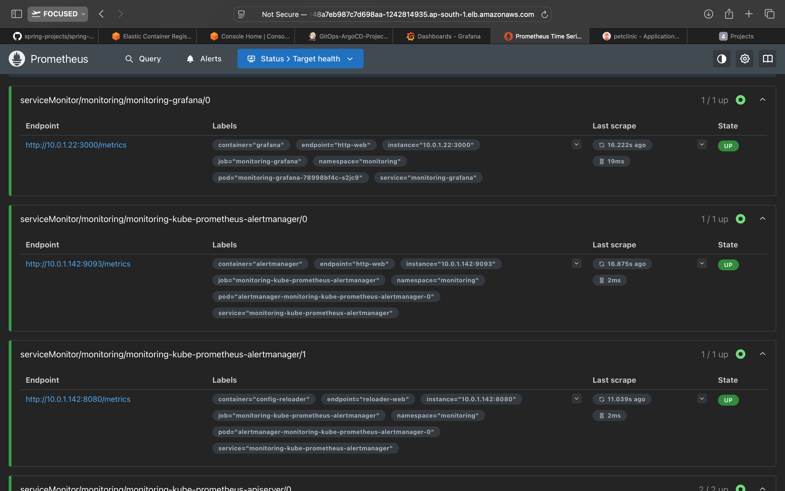</p>
<br>
</details>

<details>
<summary><b>View Grafana dashboards</b></summary>
<br>
<p align="center">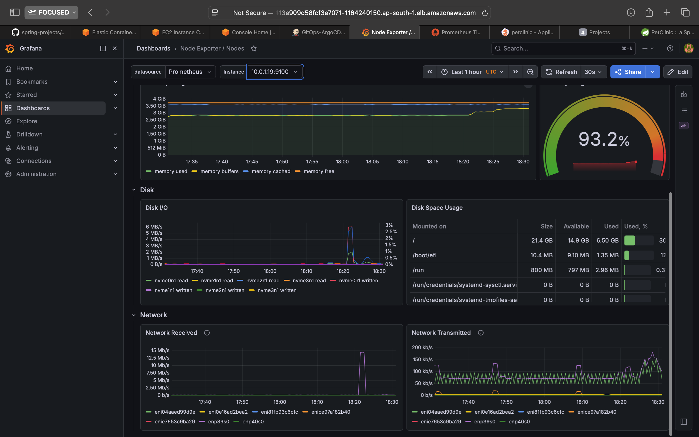</p>
<br>
<p align="center">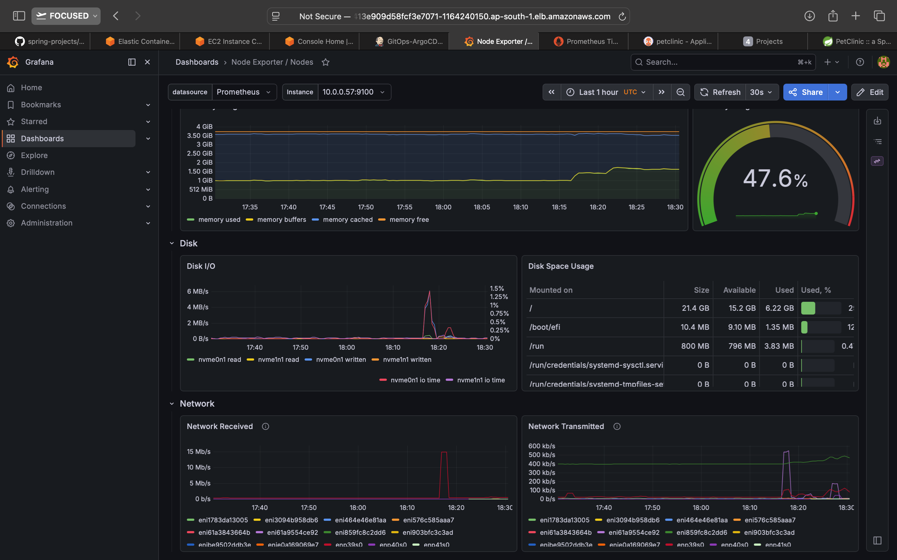</p>
<br>
<p align="center">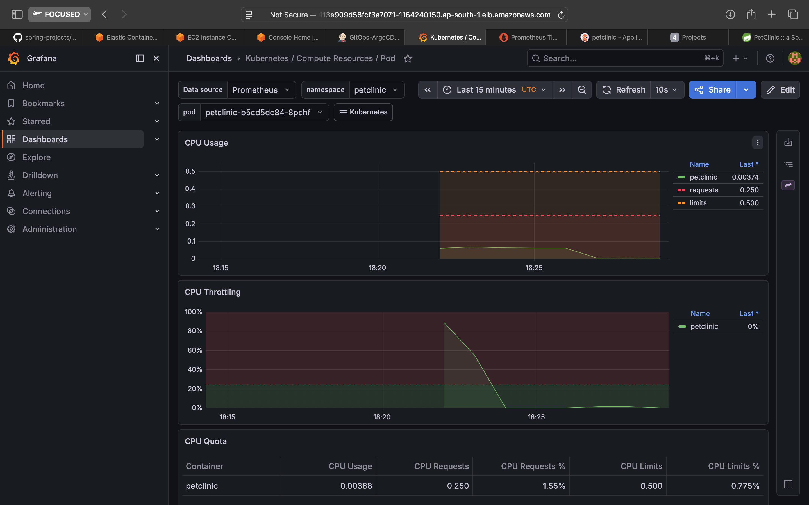</p>
<br>
<p align="center">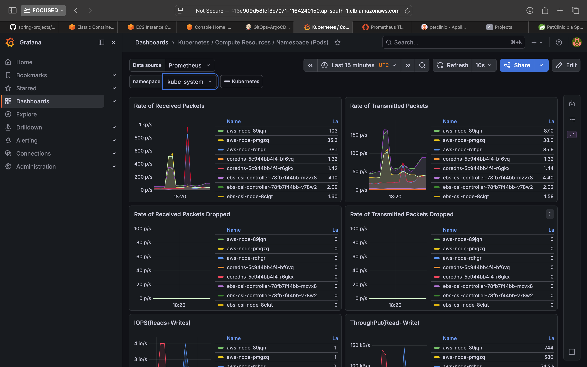</p>
<br>
<p align="center">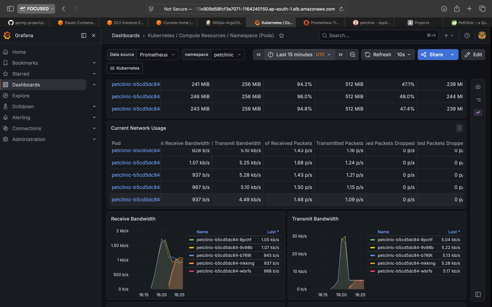</p>
<br>
<p align="center">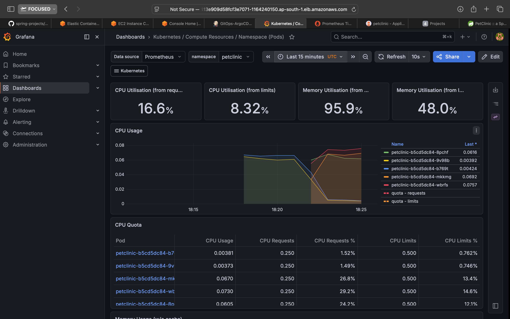</p>
</details>

---

## Application

<p align="center">
  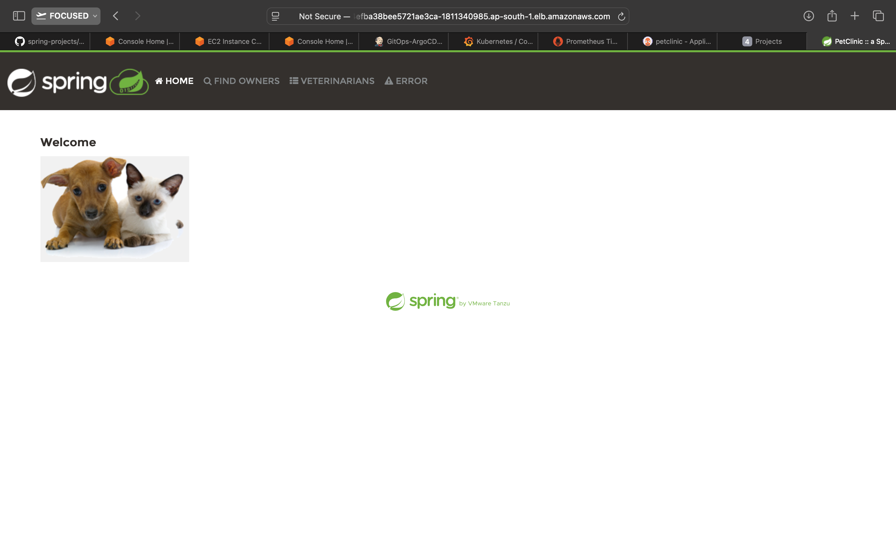
</p>

<p align="center">
  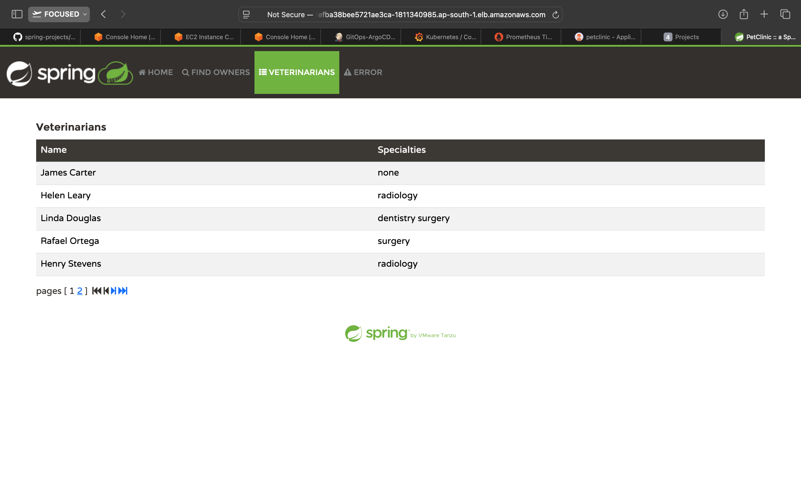
</p>

---

## Key Learnings

- GitOps principles — pull-based vs push-based CD and why the separation matters
- ArgoCD sync, drift detection, self-heal, and Git as single source of truth
- Helm chart authoring with environment-specific value overrides (dev/prod)
- Modular Terraform — VPC, IAM, EKS as separate reusable modules
- IRSA for secure pod-level AWS authentication without static credentials
- EBS CSI driver for persistent storage in EKS — required for stateful workloads
- Trivy container image scanning as a CI security gate before ECR push
- SonarQube static analysis as a code quality gate before Docker build
- Two-repo GitOps pattern — separating application code from deployment configuration
- Why Kubernetes-created resources (ELBs, EBS volumes) must be cleaned up before `terraform destroy`